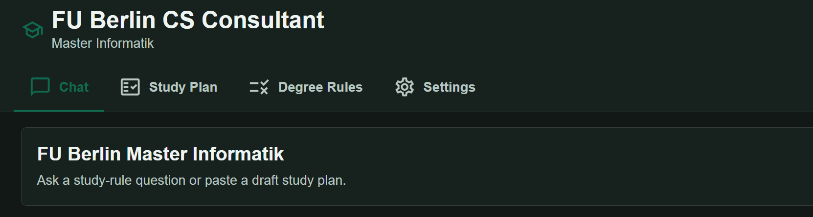
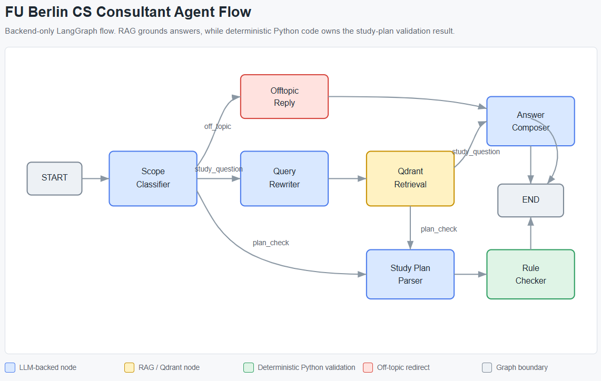
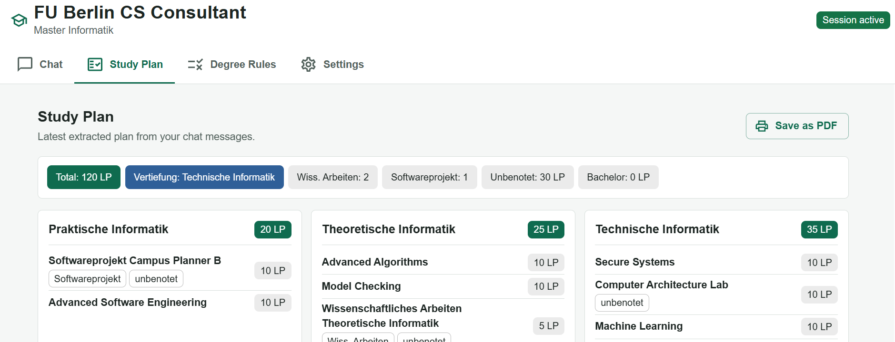

Website: [cs-modulio.com](https://cs-modulio.com)

# LeoPunkt — FU Berlin CS Consultant

Full-stack prototype for a FU Berlin computer-science study consultant, named **LeoPunkt** (a nod to *Leistungspunkte* — the LP credits it helps you track).

The app supports multiple degree programs through a backend degree registry — currently the M.Sc. Informatik (SPO 2014), the M.Sc. Data Science (FU-Mitteilungen 18/2021), and the B.Sc. Informatik (FU-Mitteilungen 23/2023). Users pick their degree in the welcome dialog and can switch later from the header; each session is bound to one degree. The app answers questions from local resources, offers a read-only Course Registry of locally listed semester offerings, and can check a proposed study plan against deterministic per-degree rules. The B.Sc. Informatik includes its 2023 degree rules and locally supplied SoSe 2026 offerings; availability in other semesters is unknown, 0084d maths courses are free-elective candidates only, and deterministic plan validation is still pending. It includes a standalone Next.js frontend and a FastAPI backend. It reuses architecture patterns from the parent `llm_chatbot` project, but all code lives inside `fu_berlin_cs_consultant/`.

## Screenshots

Agent flow:



Study plan check (visualizes the proposed study plan, then validates it against the deterministic 2014 Master Informatik rules and flags missing credits or unmet requirements):



## Scope

- No Postgres in phase 1.
- Course-offering lookup uses the local canonical course catalogue and exact semester data.
- LLM provider can be AcademicCloud or FU/local Ollama.
- Answers are advisory. Official FU Berlin documents and the examination office remain authoritative for real study decisions.

## Project Structure

```text
fu_berlin_cs_consultant/
├── backend/                     # FastAPI backend
│   ├── app/
│   │   ├── main.py              # App entrypoint
│   │   ├── routes.py            # API routes
│   │   ├── models.py            # Pydantic models
│   │   ├── settings.py          # Config
│   │   ├── domain/              # Course offerings, study plan logic, shared rule models
│   │   │   └── degrees/         # Degree registry: per-degree prompts, rules, catalogues
│   │   └── services/            # LLM providers, vector store, agent graph
│   │       ├── nodes/           # Agent graph nodes (course lookup, rule checker, ...)
│   │       └── states/          # Agent graph state
│   ├── scripts/                 # PDF extraction & resource ingestion
│   ├── tests/                   # Pytest suite
│   └── Dockerfile
├── frontend/                    # Next.js frontend
│   ├── src/
│   │   ├── app/                 # Pages & consultant UI components
│   │   ├── context/             # React context (settings)
│   │   ├── services/            # API client
│   │   ├── theme/               # MUI theme & colors
│   │   └── types/               # Shared API types
│   ├── public/                  # Static assets
│   └── Dockerfile
├── ressources/                  # Source documents & screenshots
├── docs/                        # Project docs & diagrams
├── docker-compose.yml
└── .env.example
```

## Environment

Create `.env` from `.env.example` and fill in the provider you want. Docker
Compose uses it for variable interpolation and passes backend settings into the
backend container. Optional secrets in `.env.local` override the corresponding
backend values from `.env`.

```bash
cp .env.example .env
```

Pick one provider via `LLM_PROVIDER`. Each provider reads its own `<PROVIDER>_*` vars; the others are ignored.

Deployment settings:

| Variable | Purpose | Local default |
| --- | --- | --- |
| `COMPOSE_BIND_ADDRESS` | Host address on which Compose publishes ports | `127.0.0.1` |
| `APP_DOMAIN` | Canonical public hostname served by Caddy | `localhost` |
| `APP_WWW_DOMAIN` | `www` hostname that Caddy redirects to `APP_DOMAIN` | `www.localhost` |
| `FRONTEND_PORT` | Host port for the optional local static-frontend preview | `3000` |
| `CONSULTANT_HOST` | Backend bind address inside its container | `0.0.0.0` |
| `CONSULTANT_PORT` | Backend host and container port | `8000` |
| `NEXT_PUBLIC_API_BASE_URL` | Browser-facing backend URL embedded in the static export during `next build` | `http://localhost:8000` |
| `CORS_ALLOWED_ORIGINS` | Comma-separated exact frontend origins allowed by FastAPI | `http://localhost:3000` |
| `FORWARDED_ALLOW_IPS` | Proxy IPs/CIDRs allowed to supply forwarded client IPs | `127.0.0.1` |

`CORS_ALLOWED_ORIGINS` entries must contain only scheme, hostname, and optional
port, with no path. Example: `https://consultant.example.com,https://admin.example.com`.

`NEXT_PUBLIC_API_BASE_URL` and `NEXT_PUBLIC_ENABLE_DEV_TOOLS` are public,
build-time values. Rebuild and redeploy `frontend/out` after changing either
one. Never place API keys or passwords in a `NEXT_PUBLIC_*` variable.

For production, explicitly set `NEXT_PUBLIC_API_BASE_URL`,
`CORS_ALLOWED_ORIGINS`, `LLM_PROVIDER`, and the selected provider's base URL,
model, and credentials. The bind addresses and ports have safe local defaults
but should still be reviewed before deployment.

AcademicCloud (hosted API):

```env
LLM_PROVIDER=academiccloud
ACADEMICCLOUD_MODEL=qwen3-235b-a22b
# ACADEMICCLOUD_API_KEY goes in .env.local
```

FU Ollama (cuda01 via auto SSH tunnel — no extra flag needed):

```env
LLM_PROVIDER=fu_ollama
FU_OLLAMA_MODEL=llama3.2
FU_SSH_HOST=cuda01.imp.fu-berlin.de
FU_SSH_PORT=22
# FU_SSH_USER and FU_SSH_PASSWORD go in .env.local
```

Local Ollama (running on the host machine):

```env
LLM_PROVIDER=local_ollama
LOCAL_OLLAMA_HOST=http://host.docker.internal:11434
LOCAL_OLLAMA_MODEL=llama3.2
```

Optional agent-flow tuning:

```env
AGENT_COURSE_SELECTOR_HISTORY_TURNS=2
AGENT_COURSE_SELECTOR_MAX_KEYS=20
AGENT_COURSE_SELECTOR_INCLUDE_SEMESTERS_NOTE=true
AGENT_ANSWER_COMPOSER_HISTORY_TURNS=4
```

Daily usage limits:

```env
DAILY_LLM_INVOCATIONS=200
DAILY_USER_ACTIONS=100
```

The LLM limit is global. Every call made through `ModelService` consumes one
invocation, so one chat action can consume multiple invocations. The user-action
limit applies per client IP to chat messages and transcript uploads. Creating or
deleting a session, reading program rules or course offerings, and checking
health do not consume user actions.

`GET /api/usage` exposes the current client-IP action allowance without
consuming it. Successful chat and transcript responses also carry
`X-RateLimit-Limit`, `X-RateLimit-Remaining`, `X-RateLimit-Reset`, and
`X-RateLimit-Scope` headers. The frontend shows a clickable allowance chip and
warns once per reset period when ten or fewer actions remain.

These counters are deliberately process-local Python state. They reset at
00:00 UTC and whenever the backend restarts. Run a single backend worker if the
configured numbers must remain the effective limits; each additional process
would have its own counters.

In-memory session retention:

```env
SESSION_INACTIVITY_TTL_SECONDS=172800
SESSION_CLEANUP_INTERVAL_SECONDS=300
```

Sessions are deleted after 48 hours without a message or transcript upload.
Cleanup runs opportunistically during later session activity, so no scheduler is
required. The production-visible Settings `Reset conversation` button calls
`DELETE /api/sessions/{session_id}`
before clearing browser state. Session cleanup does not delete WizardFlow trace
files; trace retention remains a separate operational concern.

Frontend developer diagnostics are build-time gated:

```env
NEXT_PUBLIC_ENABLE_DEV_TOOLS=false
```

When disabled, API/session diagnostics, health details, and dummy data are
hidden. Request allowance, chat download, and `Reset conversation` remain
available. The chat download is produced locally as Markdown and never sent to
the backend.

Semester coverage is not configured manually. The course selector derives
available semesters from the session degree's projection of the canonical course
catalogue and `backend/app/domain/data/course_offerings/<semester>.json` files.
The backend validates their cross-file course IDs, degree module mappings, and
area assignments at startup.

## Local Development With Docker Compose

Create the local configuration, add the secret required by the selected LLM
provider, then build and start the backend plus an optional static-frontend
preview:

```bash
cp .env.example .env
# Add ACADEMICCLOUD_API_KEY or the selected provider's credentials to
# .env.local. Both files are ignored by Git.
cd frontend && npm run build:local && cd ..
docker compose --profile frontend-preview up --build
```

`npm run build:local` bakes `http://localhost:8000` as the API base URL and
enables the developer tools. Both `build:local` and `build:prod` work the same
on Linux, macOS, and Windows (`build:local` sets its variables via `cross-env`).
Do not commit `frontend/out/` from a local build; the tracked export must
always come from `npm run build:prod` (see the production section below).

The default local endpoints are:

```text
Frontend: http://localhost:3000/consultant
Backend:  http://localhost:8000
API docs: http://localhost:8000/docs
```

Changing `NEXT_PUBLIC_API_BASE_URL` requires a static export rebuild. Use:

```bash
cd frontend && npm run build:local && cd ..
docker compose --profile frontend-preview up --build -d
```

To package an already-built static export for the local preview:

```bash
docker compose build backend
docker compose --profile frontend-preview build frontend
docker compose --profile frontend-preview up
```

Follow runtime logs after services start:

```bash
docker compose logs -f backend frontend
```

The backend Dockerfile has timeouts around apt:

- package index update: 300 seconds
- system dependency install: 600 seconds

The image switches Debian's default package sources from HTTP to HTTPS before
updating the package index. If one of the guarded apt commands still times out,
the problem is Debian mirror access from Docker rather than Python dependency
resolution.

## Production Deployment On A DigitalOcean Droplet

The production Compose profile adds Caddy. Caddy terminates HTTPS, serves the
locally built static frontend export, and proxies backend paths over the
internal Compose network. There is no Node.js frontend process on the Droplet.
The frontend is built locally and shipped as a static artifact specifically to
keep the build off the Droplet, which is resource-constrained; the server only
serves files and runs the backend. The backend port remains published only on
host loopback for diagnostics:

```text
Internet -> Caddy :80/:443 -> frontend/out static files
                           -> backend:8000 for /api, /health, and API docs
```

Prerequisites:

- A Droplet with Docker Engine and the Docker Compose plugin installed.
- A domain whose DNS record points to the Droplet.
- A firewall allowing SSH, HTTP, HTTPS, and optionally HTTPS/UDP for HTTP/3.
  Do not expose application ports publicly.

Build the static export on the local machine with the production public API
origin. `frontend/out/` is a tracked deployment artifact, so include its
refreshed contents in the deployment revision before updating the server.

```bash
cd frontend
npm run build:prod
cd ..
```

`build:prod` (like plain `npm run build`) takes the production values from the
tracked `frontend/.env.production`, so no environment juggling is needed. After
testing with `build:local`, always run `build:prod` before committing
`frontend/out/`.

Create the production environment on the server and restrict its permissions:

```bash
cp .env.example .env
chmod 600 .env
```

Example production values for a single-domain deployment:

```env
COMPOSE_BIND_ADDRESS=127.0.0.1
FRONTEND_PORT=3000
CONSULTANT_HOST=0.0.0.0
CONSULTANT_PORT=8000

# Public DNS name only; do not include https:// or a path.
APP_DOMAIN=cs-modulio.com
APP_WWW_DOMAIN=www.cs-modulio.com
CADDY_HTTP_PORT=80
CADDY_HTTPS_PORT=443

NEXT_PUBLIC_API_BASE_URL=https://cs-modulio.com
CORS_ALLOWED_ORIGINS=https://cs-modulio.com
NEXT_PUBLIC_ENABLE_DEV_TOOLS=false

# The backend port is loopback-only, so only local processes can reach it.
# Trust forwarded client IPs from the host reverse proxy/Docker gateway.
FORWARDED_ALLOW_IPS=*

LLM_PROVIDER=academiccloud
ACADEMICCLOUD_BASE_URL=https://provider.example.com/v1
ACADEMICCLOUD_MODEL=your-model-name
ACADEMICCLOUD_API_KEY=replace-with-the-real-secret-on-the-server

WIZARDFLOW_ENABLED=false
```

The placeholder values above are examples only. Use the real provider URL,
model, and secret for the selected provider. Do not commit the production
`.env` file.

`FORWARDED_ALLOW_IPS=*` is appropriate here only while the backend is not
published publicly. Caddy supplies the original client address through
forwarded headers, which keeps per-client quotas working.

Create an `A` record (and `AAAA` only when IPv6 is configured) from
`APP_DOMAIN` to the Droplet. Create `APP_WWW_DOMAIN` as a DNS alias for the
same host; Caddy redirects it permanently to `APP_DOMAIN`. Ensure ports 80 and
443 are free, then deploy the production profile:

```bash
docker compose --profile production up --build -d
docker compose ps
docker compose logs -f caddy backend
```

Caddy obtains and renews the TLS certificate automatically. Certificate state
is persisted in the `caddy_data` volume; do not delete that volume during normal
deployments. Check certificate or routing failures with
`docker compose logs --tail=200 caddy`.

After any `NEXT_PUBLIC_*` change, rebuild the static export locally and upload
the refreshed `frontend/out/` directory before restarting Caddy. Backend-only
environment changes require a container recreation but not an image rebuild.

Production frontend:

```text
https://cs-modulio.com/
```

Production health check:

```text
https://cs-modulio.com/health
```

## WizardFlow Traces

WizardFlow tracing is enabled by default. Each chat request and transcript
upload receives a new UUID, and each active agent node writes payloads into a
JSONL trace under `backend/traces/`. Docker persists `/app/traces` to that host
directory.

LLM-backed nodes record:

```text
llm_input  -> {"prompt": "...", "msg": "..."}
llm_output -> raw model response
llm_error  -> exception type and message, when a fallback is used
```

Deterministic nodes record `node_input` and `node_output`. The `__start__` graph
step is not logged; `__end__` is finalized as a payload-free marker. Trace
failures are logged but do not fail consultant requests.

Configuration:

```env
WIZARDFLOW_ENABLED=true
WIZARDFLOW_OUTPUT_DIR=traces
WIZARDFLOW_FILE_PREFIX=fu_cs_consultant
```

For a university production deployment that promises session-only temporary
storage, set `WIZARDFLOW_ENABLED=false`. When tracing is enabled, the welcome
dialog discloses that unredacted diagnostic files may outlive in-memory session
state.

All traffic is written into one long-lived trace file per backend process. To
start a fresh timestamped trace file without restarting the backend (for
example before a manual test run), use the `New Trace File` button in the
Settings developer section, or call the endpoint directly:

```bash
curl -X POST http://localhost:8000/api/tracing/reinit
```

The old file is left as-is, open messages carry over into the new file, and a
disabled tracer answers HTTP 409 with `error_code == "tracing_disabled"`.

From `backend/`, inspect a generated trace with:

```bash
wizardflow ui traces/<trace-file>.jsonl
wizardflow json traces/<trace-file>.jsonl
```

Trace files contain unredacted system prompts, chat messages, and extracted
transcript text. Treat `backend/traces/` as sensitive local data; it is excluded
from Git.

## API

List the supported degree programs:

```bash
curl http://localhost:8000/api/degrees
```

Create a session (degree defaults to `msc_informatik` when the body is omitted):

```bash
curl -X POST http://localhost:8000/api/sessions \
  -H "Content-Type: application/json" \
  -d "{\"degree\":\"msc_data_science\"}"
```

Read the degree-rule catalogue for one degree:

```bash
curl "http://localhost:8000/api/program-rules?degree=msc_informatik"
```

Read locally listed course offerings for one degree:

```bash
curl "http://localhost:8000/api/course-offerings?degree=msc_informatik"
```

Delete a session and its in-memory LangGraph state:

```bash
curl -X DELETE http://localhost:8000/api/sessions/<session-id>
```

Read the current client request allowance and retention information:

```bash
curl http://localhost:8000/api/usage
```

Ask a question:

```bash
curl -X POST http://localhost:8000/api/sessions/<session-id>/message \
  -H "Content-Type: application/json" \
  -d "{\"content\":\"Wie viele LP brauche ich im Anwendungsbereich?\"}"
```

Check a study plan:

```bash
curl -X POST http://localhost:8000/api/sessions/<session-id>/message \
  -H "Content-Type: application/json" \
  -d "{\"content\":\"Bitte pruefe meinen Studienplan mit Vertiefung Praktische Informatik: Softwareprojekt Praktische Informatik B 10 LP, Wissenschaftliches Arbeiten Praktische Informatik A 5 LP, Projektmanagement 5 LP, Kuenstliche Intelligenz 5 LP, Datenbanktechnologie 5 LP, Rechnersicherheit 10 LP, Algorithmische Geometrie 10 LP, Modelchecking 10 LP, Betriebssysteme 10 LP, Wissenschaftliches Arbeiten Technische Informatik A 5 LP, Mobilkommunikation 5 LP, Anwendungsmodul A 10 LP.\"}"
```

Health:

```bash
curl http://localhost:8000/health
```

## Tests

From `fu_berlin_cs_consultant/backend`:

```bash
uv run --isolated --python 3.12.10 --with-requirements requirements.txt --with pytest python -m pytest -q
```

The current tests cover deterministic rule checking, resource chunking, and pure routing helpers.

From `fu_berlin_cs_consultant/frontend`:

```bash
npm run lint
npx tsc --noEmit
npm run build
```
